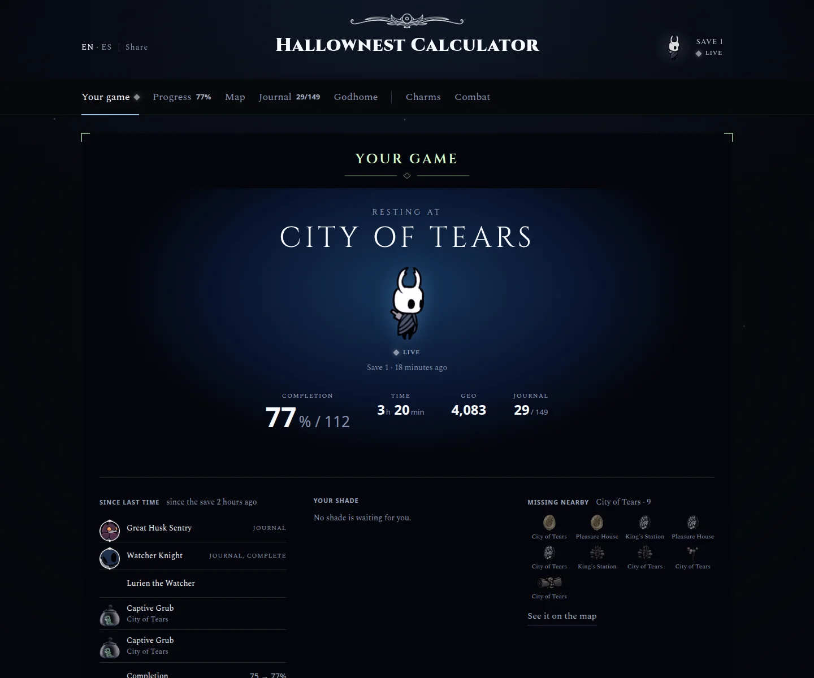
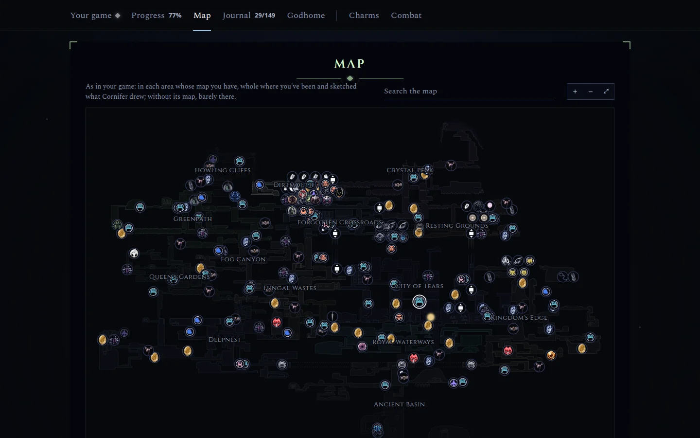

<div align="center">

# Hallownest Calculator

**Your real Hollow Knight game, followed live — and every charm's effect on the Knight. In English and Spanish.**

Import your save and the site shows it as the game does: the 112% item by item, the game's own
map with what you're missing, the Hunter's Journal and Godhome. Keep playing, and every time you
sit on a bench it catches up and tells you what you got. Then try builds and take them into a fight.

[**Open the calculator**](https://betorzdev.github.io/hallownest-calculator/)
&nbsp;·&nbsp; [Full guide](docs/guide.md)
&nbsp;·&nbsp; [Report a wrong number](https://github.com/betorzdev/hallownest-calculator/issues)

<br>



</div>

## What it does

<table>
<tr>
<td colspan="2" valign="top">

### Your game, live
Import your save file (`user1.dat`…) and **the site follows it**: with Chrome or Edge, every time
the game saves at a bench the page catches up by itself and says what changed. The start screen
is your game at a glance: the area you rest in, your completion, the time played, **what you got
since last time**, your shade and **what's still missing around your bench**. Four save slots,
like the game's, or keep one by hand if you play elsewhere.

</td>
</tr>
<tr>
<td valign="top">

### Progress and the Map
The **112% exactly as the game counts it**, category by category, and the **game's own map**, drawn
from its files, with every grub, shard, relic and root on it, found or not.

</td>
<td valign="top">

### Hunter's Journal
Entry by entry, from "not encountered" to "completed", with the kills left to decipher each one.
The total works like the game's: 146, growing to 164.

</td>
</tr>
<tr>
<td valign="top">

</td>
<td valign="top">

</td>
</tr>
<tr>
<td colspan="2" valign="top">

### Godhome
The **Hall of Gods' 44 statues** on Attuned, Ascended and Radiant, and the **five Pantheons** room by
room, with bindings, the hot springs and the Lifeblood cocoon: the symbols you've won and a
simulator to try each fight with your build.

</td>
</tr>
<tr>
<td valign="top">

</td>
<td valign="top">

</td>
</tr>
<tr>
<td valign="top">

### Charms
All 45 charms on the game's own Inventory screen. **Hover one and see what it would change**
before you equip it: nail damage, DPS, hits until you die, soul per hit, healing time, every
spell. Overcharm and notches work as in the game.

</td>
<td valign="top">

### Combat
Fight **180 enemies and bosses** with your build, hit by hit: phases, armour, the soul you gain,
the masks you lose. Answers the question no other site does: *how many hits does this boss
take?*

</td>
</tr>
<tr>
<td valign="top">

</td>
<td valign="top">

</td>
</tr>
<tr>
<td colspan="2" valign="top">

### Spells, Nail Arts and effects
Under the charms, what each spell and Nail Art hits for with your build, and **what your
charms do that the numbers don't show**: Weaverlings, Dreamshield, Thorns, the Elegy beams…
with the synergies between them marked.


</td>
</tr>
<tr>
<td valign="top">

### Inventory
Under your game, the Knight as the save has him: your nail, masks, soul vessels, notches, spells,
nail arts, equipment and items. With no save, a free mode with everything unlocked to try builds,
or start from the base Knight.


</td>
<td valign="top" align="center">

### In your pocket, in two languages
Works just as well on a phone. English and Spanish, with every name copied from the game's own
official translation.


&nbsp;


</td>
</tr>
</table>

## Why trust the numbers

- **Every value comes from [hollowknight.wiki](https://hollowknight.wiki/)**, page by page, and
  is checked by the tests.
- **The game's own rounding**: Unity rounds half to the even integer, so Strength and Fury give
  the same numbers you see in-game.
- **The game's own words**: names are taken from its text files, never translated by hand.

How each number is worked out is in the [guide](docs/guide.md#where-the-numbers-come-from).

## Run it

No framework, no build, no install. Double-click `index.html`, or serve the folder:

```sh
python3 -m http.server 8000    # then http://localhost:8000
npm test                       # node --test, no dependencies
```

Your build lives in the URL, so **Share** gives you a link to exactly what you're wearing. Following
a save live needs Chrome or Edge on a computer (the File System Access API); importing it once works
anywhere.

## Documentation

| | |
|---|---|
| [`docs/guide.md`](docs/guide.md) | Every screen in detail, the files, the URL format, the numbers and languages |
| [`design/`](design/README.md) | The design system and the research behind it |
| [`kb/`](kb/) | Combat knowledge base: bosses, enemy health, Godhome, the Colosseum, builds |
| [`CLAUDE.md`](CLAUDE.md) | The rules for working on the code and the translations |

## Credits

**Unofficial fan project**, free and non-commercial, not affiliated with or endorsed by
[Team Cherry](https://www.teamcherry.com.au/). *Hollow Knight*, its artwork, texts and names
are © Team Cherry.

Data from [hollowknight.wiki](https://hollowknight.wiki/) and the
[Spanish wiki](https://hollowknight.fandom.com/es/) (CC BY-SA 3.0); game texts from
[stradivari96/hollow-knight-translator](https://github.com/stradivari96/hollow-knight-translator);
fonts under the [SIL OFL 1.1](assets/fonts/OFL.txt). The code is [MIT](LICENSE). The details
are in the [guide](docs/guide.md#credits-and-licences).

Made by **Albert** ([@betorzdev](https://github.com/betorzdev)) ·
[betorzdev@gmail.com](mailto:betorzdev@gmail.com)
